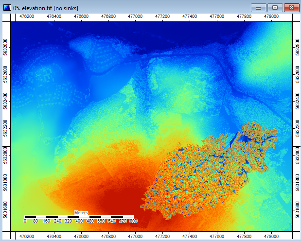

##  Local drainage direction

####some basic settings

```{r eval=FALSE}
# (R) load libs
library(RSAGA)
library(gdalUtils)
library(raster)
library(spgrass6)
library(perfectPeak)

#--- set environment variables for RSAGA and GRASS
# NOTE you probably have to customize some settings

source("GitHub/data/gis/data/rdata/path_gis.R")
##path to saga and OSGeo shells

source("GitHub/data/gis/data/rdata/shells.R")

outpath <- gisres
sagaCmd<-saga3


  
```

## Function to calculate the watershed of a given outlet

```{r eval=FALSE}
x <-474266.4
y <-5630356.4

dem<-raster(paste0(gis_in_base, "elevation.tif" ))


twi_watershed <- function(outpath, dem, saga3, x, y){
  #convert dem to sgrd
  gdalUtils::gdalwarp(dem, paste0(outpath,"dem.sdat"), 
                      overwrite=TRUE,  of='SAGA')

  #preparation: 
  #fill sinks
  system(paste0(sagaCmd, " ta_preprocessor 4",
                " -ELEV=",outpath, "dem.sgrd",
                " -FILLED=",outpath,"dem_filled.sgrd")
  )
  
  #slope, aspect, curvature-tool (slope needed for calculation of TWI)
  system(paste0(sagaCmd, " ta_morphometry 0",
                " -ELEVATION=",outpath, "dem.sgrd",
                " -SLOPE=",outpath,"slope.sgrd")
  )
  
  #calculate flow accumulation (Top-Down)
  system(paste0(sagaCmd, " ta_hydrology 0",
                " -ELEVATION=",outpath, "dem_filled.sgrd",
                " -FLOW=",outpath,"flow_acc_td.sgrd")
  )
  
  #calculate TWI (goal of the process)
  system(paste0(sagaCmd, " ta_hydrology 20",
                " -SLOPE=",outpath, "slope.sgrd",
                " -AREA=",outpath, "flow_acc_td.sgrd",
                " -TWI=", outpath, "TWI.sgrd")
  )
  
  #calculate watershed for the outlet at 477755.4E, 5632178.4N (scale of the process)
  system(paste0(sagaCmd, " ta_hydrology 4",
                " -TARGET_PT_X",x,
                " -TARGET_PT_Y",y,
                " -ELEVATION=",outpath, "dem_filled.sgrd",
                " -AREA=",outpath, "upslope.sgrd")
  )
  
  #reconverting .sgrd to .tif
  gdalUtils::gdalwarp(paste0(outpath,"upslope.sdat"),
                      paste0(outpath,"upslope.tif"), 
                      overwrite=TRUE, of="GTiff") 
  
  gdalUtils::gdalwarp(paste0(outpath,"TWI.sdat"),
                      paste0(outpath,"TWI.tif"), 
                      overwrite=TRUE, of="GTiff") 
  
  #read upslope and twi-Rasters
  upslope <- raster(paste0(outpath, "upslope.tif"))
  twi <- raster(paste0(outpath, "TWI.tif"))
  
  #form grid with twi for catchment area
  twi_upslope <- twi
  twi_upslope[upslope==0] <- NA

  writeRaster(twi_upslope,paste0(outpath,"twi_upslope.tif"))
}

twi_watershed(outpath, dem, sagaCmd, x, y)

````
##Wetnesindex for the Catchmentarea of a given Point



##Channelnetwork
```{r eval=FALSE}
cmd<-paste0(saga2, ' ta_channels 5 ', 
            " -DEM ",outpath, "dem.sgrd",
            " -DIRECTION ", outpath,"flow_dir.sdat")
system(cmd)


cmd<- paste0(saga3, " ta_channels 0 ", "-ELEVATION=", outpath, "elevation.sgrd ", 
             "-SINKROUTE=", outpath,"flow_dir.sgrd"," -CHNLNTWRK=", outpath,
             "chnlntwrk.sdat ", "-CHNLROUTE=", outpath,"chnl_route.sdat ", "-SHAPES=" , outpath,
             "chnl.shp", " -INIT_GRID=", outpath,"CAREA.sgrd ", 
             "-INIT_METHOD=2 -INIT_VALUE=0.000000 -DIV_GRID=NULL -DIV_CELLS=5 -TRACE_WEIGHT=NULL -MINLEN=10")

system(cmd)

###overland flow distance to channel network

cmd<- paste0(saga3, " ta_channels 4 ", "-ELEVATION=", outpath, "elevation.sgrd ", 
             " -CHANNELS=", outpath,"chnlntwrk.sdat ",  "-ROUTE=", outpath,"flow_dir.sgrd ",
             "-DISTANCE=", outpath,"DISTANCE.sdat ", "-DISTVERT=" , outpath,
             "DISTVERT.sdat", " -DISTHORZ=", outpath,"DISTHORZ.sgrd ", 
             "-PASSES=", outpath, "fields_visited.sgrd")

system(cmd)


#form grid with Overland Flow Distance for catchment area
upslope<-raster(paste0(gis_in_base, "upslope.tif"))
dist_horz_upslope<-raster(paste0(gis_in_base, "DISTANCE.sdat"))
dist_horz_upslope[upslope==0] <- NA

writeRaster(dist_horz_upslope,paste0(outpath,"dist_upslope.tif"))

````


###Overland Flow Distance for a given Catchment Area


